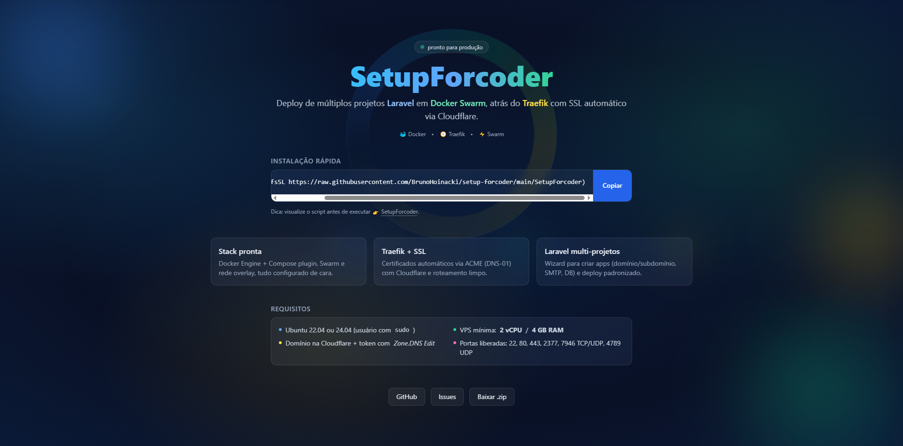

<a href="https://setup.forcoder.com.br">

</a>

**Deploy automatizado de aplicações Laravel em Docker Swarm, com Traefik + SSL via Cloudflare.**
Um projeto **open-source**, direto ao ponto, feito para simplificar a vida no servidor. 🚀

---

## 🔥 O que é?

O **SetupForcoder** transforma uma VPS Ubuntu em um ambiente pronto para produção:

* 🐳 **Docker Engine + Compose plugin**
* ⚡ **Docker Swarm** inicializado automaticamente
* 🌐 **Traefik** como proxy reverso + SSL automático (Cloudflare DNS-01)
* 📂 Estrutura padrão em `/workspace` para organizar múltiplos projetos Laravel
* 📡 Configuração automática de DNS e SMTP por aplicação

---

## 📌 Requisitos

* Ubuntu **22.04+**
* VPS com pelo menos **2 vCPU / 4GB RAM**
* Domínio configurado na **Cloudflare** (token com permissão `Zone.DNS Edit`)
* Servidor **limpo (fresh install)** para evitar conflitos

---

## 💿 Instalação rápida

Basta rodar na sua VPS:

```bash
bash <(curl -sSL https://setup.forcoder.com.br)
```

Após finalizar a instalação:

```bash
make traefik:deploy
make app:new
```

---

## ⚙️ Funcionalidades

* 🔸 Deploy multi-projetos Laravel
* 🔸 Proxy reverso com Traefik + certificados SSL
* 🔸 Banco de dados MySQL pronto para uso
* 🔸 Configuração de SMTP por aplicação
* 🔸 DNS automático via Cloudflare
* 🔸 Menu interativo para deploy

---

## 🤝 Contribuindo

Esse projeto é **open-source** — pull requests, issues e feedbacks são super bem-vindos.

---

## 📜 Licença

Distribuído sob a licença **MIT**.
